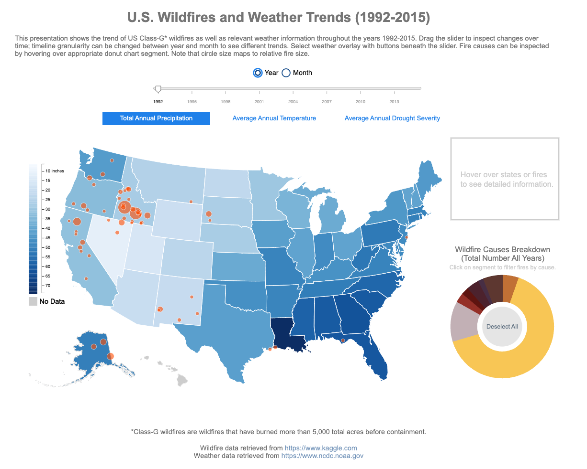
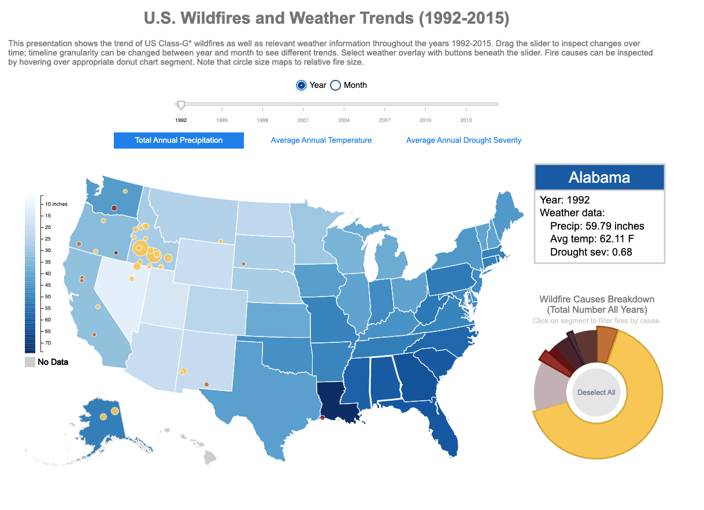

# cs3300_p2
# U.S. Wildfires and Weather Trends (1992 - 2015)
## By Connor (Cornell net ID: cam462), Angela Zheng (Cornell net ID: az428), Wenjia (Cornell net ID: wz276)

# Introduction
This dashboard was developed for my Data-Driven Web Applications course. Visualizations were developed using d3.JS within an HTML sheet. The site must be hosted locally using http.server in order for the visualizations to function properly. A breakdown of tasks can be found within the Word documents and PDF within this repo. Excerpts below were extracted from the final write-up. 

# Screenshots 
Dashboard Overall 

Interactivity 

# Data
## Weather Data 
We retrieved our weather data from the National Oceanic and Atmospheric Administration’s National Center for Environmental Information. The data was retrieved manually state-by-state from https://www7.ncdc.noaa.gov/CDO/CDODivisionalSelect.jsp# and was later aggregated with Excel into one data file (state_weather_history.csv), which can be found in the datasets folder of our Git repository. The data we used from this data source included the following weather attributes for all states and for all months between January 1992 and December 2015: monthly precipitation (PCP column), monthly average temperature (TAVG column), and Palmer Drought Severity Index (PDSI column) which ranges from -10 (dry) to +10 (wet). There were additional weather attributes available to us at the per-month per-state granularity, but we filtered these out as we did not find them necessary.

Upon loading the weather data, we first convert all attributes to JavaScript Number types. We then compute yearly weather data using the monthly data so that users can see both monthly and yearly weather trends for all three of our weather attributes (precipitation, temperature, and drought severity) using the various buttons at their disposal. We summed monthly precipitation to give total annual precipitation per year per state, and we averaged monthly temperature and drought severity to give respective averages per year per state.

## Wildfire Data
We got the fire dataset from Kaggle as a sqlite file. The original file size was unmanageable at around 175MB with 1.88 million wildfires, and it contained data from the 1980s. Using DB Browser we exported the columns we needed into a manageable csv file. We were primarily able to reduce the size of the dataset by filtering out all wildfires smaller than Class-G (>5,000 acres). We selected the following columns: the fire name, day of the year the fire was discovered; discovery date; fire year; fire cause; size; latitude; longitude; state; containment date; and day of the year that the fire was contained. We filtered name, cause, and state as strings and filtered the rest as numbers. 

A dictionary of fire causes and the number of incidents related to that cause was created from the dataset to map out a donut chart. We used the FIRE_CAUSE column to create dictionary keys and created counter values for each cause. 

We used this Latitude and Longitude information to map out fire positions and fire size to map relative size on a choropleth map of the United States. Additional details such as the Fire’s name, cause, size, and days to containment appear when the user hovers over a specific fire. 

## Map Data
We used TopoJSON to draw our U.S. map using the “us.json” file in our datasets directory of the Git repository. The “us.json” file was retrieved from the course Git repository, along with “us-state-names.tsv” which was used to create “state_codes.csv”. We credit Mike Bostock for both “us.json” and “us-state-names.tsv”. “State_codes.csv” was manually created so that we could relate state names, state map ids, and state weather ids to one another in our JS logic.
